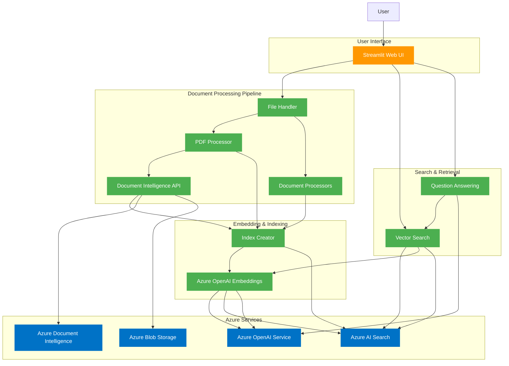

# Document Intelligence and Search Application Architecture

## Component Descriptions

### User Interface
- **Streamlit Web UI**: Web-based user interface for uploading documents and asking questions (app.py)

### Document Processing Pipeline
- **File Handler**: Validates and routes files to appropriate processors (file_handler.py)
- **PDF Processor**: Processes PDF documents, handles both native and image-based PDFs (pdf_processor.py)
- **Document Intelligence API**: OCR and document analysis for image-based PDFs (leveraged by pdf_processor.py)
- **Document Processors**: Processing for other document types like Word, PowerPoint, etc.

### Embedding & Indexing
- **Azure OpenAI Embeddings**: Generates vector embeddings for document chunks (via AzureOpenAIEmbeddings)
- **Index Creator**: Creates and manages Azure AI Search indexes (create_index_from_file.py)

### Search & Retrieval
- **Vector Search**: Retrieves relevant document chunks using vector search (search_documents function)
- **Question Answering**: Generates answers based on retrieved document chunks (ask_question function)

### Azure Services
- **Azure OpenAI Service**: Provides embeddings and text generation capabilities
- **Azure AI Search**: Stores and retrieves document chunks using vector search
- **Azure Document Intelligence**: OCR and document layout analysis for image-based PDFs
- **Azure Blob Storage**: Optional storage for processed documents

## Data Flow

1. **Document Upload Flow**:
   - User uploads document via Streamlit UI
   - File Handler validates and identifies document type
   - Appropriate processor extracts text (using Document Intelligence for image PDFs if needed)
   - Document is chunked and embeddings are generated
   - Chunks and embeddings are stored in Azure AI Search index

2. **Question Answering Flow**:
   - User asks question via Streamlit UI
   - Question is converted to vector embedding
   - Vector search retrieves relevant document chunks
   - Retrieved chunks are sent with the question to Azure OpenAI
   - Answer is generated and displayed to user with source references
